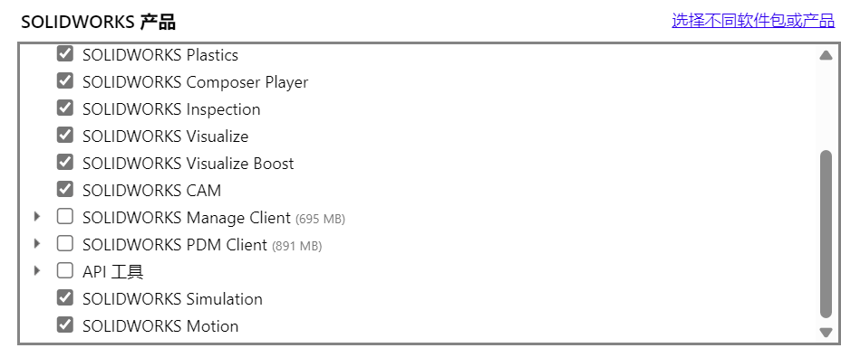
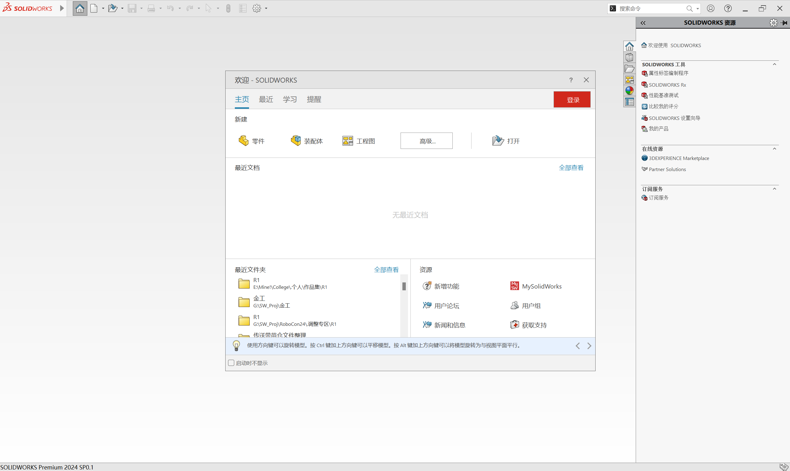
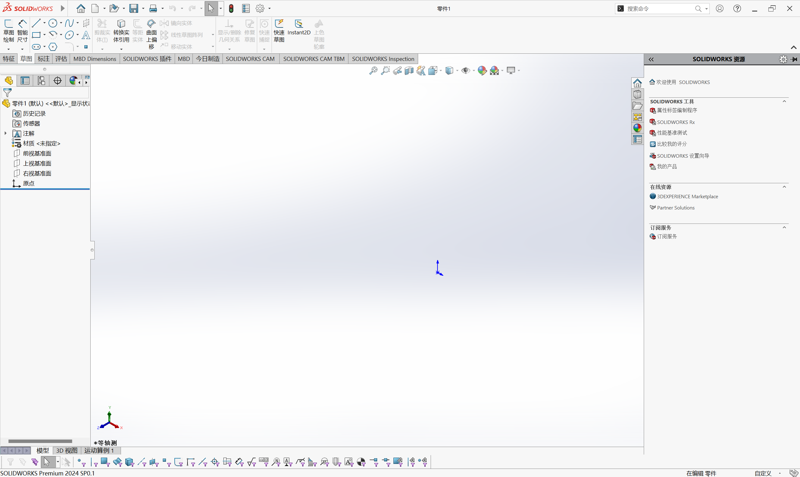
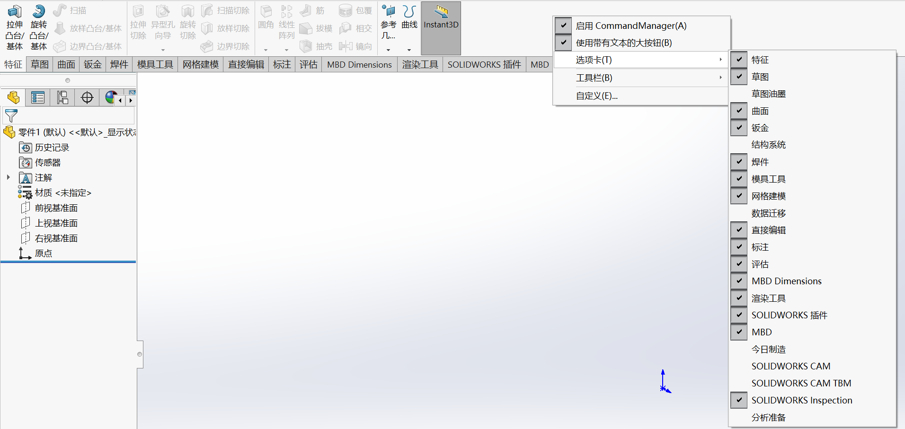
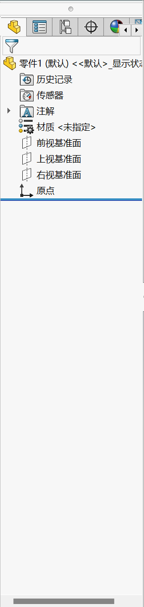
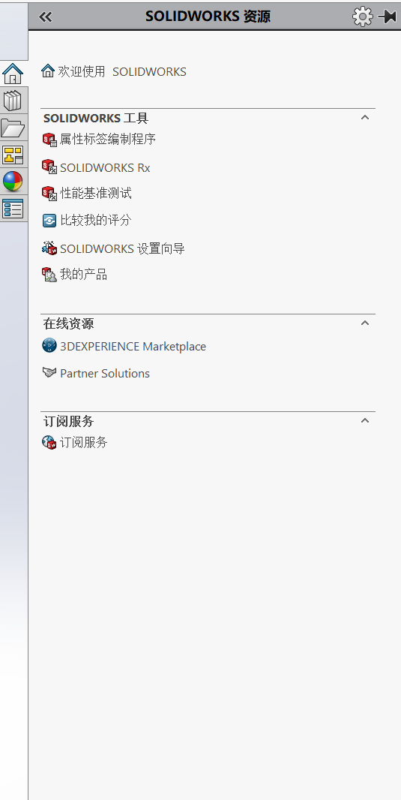
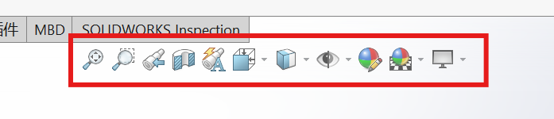
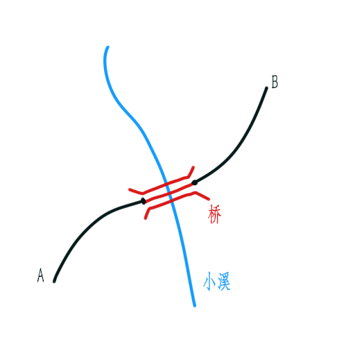

# 从萌新到SOLIDWORKS仙人

作者：[陈羿帆](https://www.zhihu.com/people/xiao-fan-chuan-de-miao-zhu-zi)

**SW，启动！**

[TOC]

## 序章 一张白纸

### 第一节 你学的是个什么玩意儿

早上好，SOLIDWORKS！
在有志成为[华南理工大学RobotIC实验室](https://space.bilibili.com/3493115813955925/)机械组的一员的你开始大展拳脚前，你需要先阅读这一章，**搞明白自己要干什么**。本书旨在为有志加入机械组——以及已经是机械组的一员，但是想修整一下自己的工作习惯的同志们提供指导。

众所周知，本实验室机械组是竞赛队中负责机械设计与制造工作的组，主要业务有机器人的设计、生产，加工设备的维护、管理等等。本书聚焦的就是机械组业务中最核心的**设计**环节。**设计**虽然是一个看起来跟画画很像的工作，但实际上也确实很像。对于大部分洋溢着青涩的大学新生来说，以往经历中与 “设计” 最接近的其实是出黑板报。对于属于“命题作文”的黑板报来说，要成为 “好” 的一期板报，不仅要美观，还要有优质的、**贴合主题**的内容。这就是**设计**与**美术**最大的差别：**设计**要的其实是功能，而**美术**侧重于表达。

显而易见，对机器人进行的**机械设计**本质是创造能够满足特定功能、要求和目标的机械系统。对于有志于参与机械设计工作的新手而言，想要表明自己正在做的是一个怎样的玩意儿，似乎只能在纸上用笔画出来。那么把这样的工作数字化，是不是就是使用**画画软件**用画笔一笔一笔把东西画出来，并且可以称之为**计算机辅助设计**（CAD）了呢？

那不能够啊！21世纪过了五分之一有多了，哪有用电脑用的这么憋屈的。工作不是高考，计算机能帮忙解决的事情为什么还要亲自动手。所谓点两下能画出来的圆就别用笔划，秉持着这样的思想，通过计算机完成横平竖直圆滚滚等乱七八糟的杂活儿，把需要亲自把握的工作留给人，为机械设计提供这样辅助的软件，就是CAD软件。

熟悉数码产品的同志们可能知道，智能手机的世界仿佛一个江湖，操作系统就是各手机的流派，品牌则像是各手机的门派。在CAD的江湖里，主要的门派当属下面这些：AUTODESK公司的AUTOCAD和FUSION，西门子公司的NX（也叫UG），PTC公司的Creo（也就是PRO/E），以及达索系统公司的CATIA和SOLIDWORKS。这些门派中AUTOCAD属于老艺术家，FUSION则是集合众多华丽技术的时尚达人，NX是没有任何幽默感和不良嗜好的样板级德国人，Creo是个现代画家，CATIA是低调的宗师，而我们要学的SOLIDWORKS则是个穿人字拖的靓仔。那么为什么我们选择穿人字拖的靓仔呢？因为它有免费高级版资源，以及它最好学。

因此前面讲了那么多，其实就是为了告诉你，本书要教的是使用SOLIDWORKS进行机械设计。它是一款由达索系统公司——没错，就是研发了 “幻影” 系列和 “阵风” 系列战斗机的那个达索飞机公司的子公司——从美国收购来的，一款适合中小机电系统设计的CAD软件，你能在中文互联网上找到它的破解高级版（免费的哦），并且它在CAD软件中非常好上手。

这下你应该知道你在本书中要学的是什么玩意儿了。

### 第二节 你自己的SOLIDWORKS

在正式开始学习前，你要首先在自己的电脑上**自己安装**SOLIDWORKS。如[上一节](#第一节-你学的是个什么玩意儿)所说，该软件在中文互联网上有**免费的，破解的高级版**，因此任何在这一步付出金钱的同志都应当扪心自问一下，为什么自己成了冤种。你首先需要知道自己要装的是哪个版本的SW——很简单，问一下你们组长就知道了。低版本SW打不开高版本文件，因此请确保你安装的SW版本与其它组员一致。受限于网速，这个过程会花费一定时间，但是任何具备基础电脑技能的人都能依靠破解软件包附带的教程完成。这个过程就像实验室内任何其它过程一样可以自由交流和提问，但操作应当自己完成。

RobotIC机械组组员必须安装的SW组件包括：SW本体，File Ultilities，Visualize，Motion，以及Simulation。在2024年，其余组件除电气设计组件外都可自由安装（安装电气设计组件可能会导致注册错误）。笔者额外安装了Flow Simulations，Plastics，CAM，Composer，Composer Player，Inspection以及MBD。

笔者在RobotIC担任核心队员期间使用的是SW2022，而本书所使用的是SW2024。

## 第一章 认识SOLIDWORKS

### 第一节 认识SW界面

每次你打开SW，它都会弹出一个欢迎页，这一点与大部分软件都是相同的。

欢迎页会提供通过默认模板新建文件的按钮，以及最近打开过的文档。

此次我们先新建一个**零件**文件，认识**零件**这一SW的基本单位。

新建**零件**后SW页面如图所示，最上面是**菜单栏**，其中详细菜单栏可以将鼠标移到Logo旁边的右向灰色三角上方唤出：

菜单栏下面是**选项卡**，可以右键从 “选项卡” 下拉菜单控制显示哪些选项卡。对于RobotIC机械组的同志们来说，需要用到的选项卡如图所示：

窗口右侧是**设计管家菜单**，通过不同的菜单页显示不同类型的设计元素，以树的形式排列，因此也可以叫**设计树菜单**。当前显示的是**FeatureManager 设计树**：

窗口右侧是**任务窗格**，可以从这里找到设计库、外观材质等财产以及自定义属性、文件探索器等菜单：

最下面是分属不同功能算例的工作区，将会在介绍仿真、运动算例等功能时介绍。对于一般的设计，在为建模而设立的 “模型” 区即可完成。如果打开了 “选择过滤器” 工具栏（同样可以在选项卡处右键找到 “工具栏” 下拉菜单进行控制），该工具栏会显示在工作区菜单的下方。

窗口中间显示模型的便是模型窗口，模型视图窗口上方正中的是**视图（前导）工具栏**，可以在这个窗口中选择包括剖面视图、动态注解视图等多种能有效帮助检视模型的视图：

对于RobotIC机械组队员来说，默认的带边线上色的正交图是最常用的视图。透视图只应在制作视觉资料时使用，建模时开启透视图只会使人痛苦。

在本节学习中，你可以多多翻看本节展示的各个菜单及选项卡。这将是你在本书的学习中不断开疆拓土的范围。

### 第二节 “参考”，以及SW模型的元素

在本节中你将了解SW模型的三要素：**点、线和面**，但在那之前，有必要引入SW机械设计中的核心要素：**参考**与**参考关系**。

**参考**是什么？我们可以想象一座桥，对于最最简单的跨越一条小溪的公路桥，将它抽象成简单的线段来说，只需要两个要素去定义它：就是小溪两岸的公路末端，一共两个点。对于这样一个模型，公路桥就是**参考关系**，而这两个点就是**参考**本考。

在这个案例中，如果我们需要修一条从小溪左侧的A到小溪右侧的B的路，我们首先需要将路铺到溪边，然后搭桥，然后将路延伸到B去，注意这个过程是一个不可改变的顺序关系。因此，我们只有修好了A侧的路，才知道A侧的搭桥点在哪里，然后才能确定B侧的搭桥点，进而知道B侧的路该怎么修。进一步说，**B侧搭桥点的参考是A侧的搭桥点，它的位置定义是相对于A侧搭桥点定义的，这种相对位置的定义由桥梁约束**。在SW中，想要将模型各要素的位置完全定义好，避免它在你不经意间跑来跑去，影响零件最终生产出来的效果，就需要将各要素通过约束关系锚定在已定义好的参考上，达到**完全定义**。**完全定义**的概念将会在草图一节中详细阐述。SW中除三个基础基准面和原点外，所有的设计树对象都需要参考进行定义。

回到正题，你已经了解了**参考**，接下来需要了解的是SW中的**点、线、面**。在SW中，这三种要素非常关键，因为它们就是SW建模过程中可以选择的参考。其中，**面**因为其特殊性，可以作为参考使用的场景与**点和线**有很大不同，具体的使用我们将放在后文具体功能的讲解中分析。

在SW中，点、线、面可以相互参考完成自身的定义，但总的来说是**面->点->线的一个循环**，至于为什么将**面**放在最前面，我们将在**草图**一节中了解。在这个循环中，线通过将点选作参考，结合自己的类型定义自己的位置与形状，而面由线通过直接和间接的方式定义。

### 第三节 设计树中的格局
