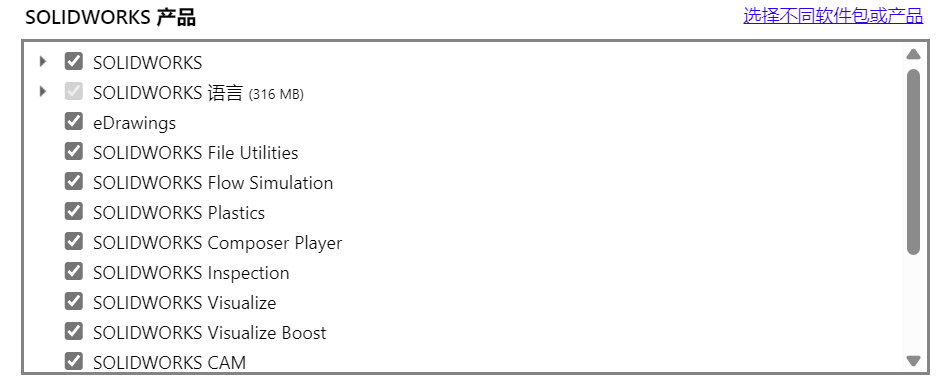
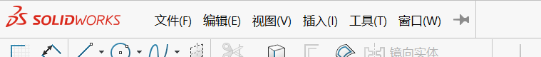
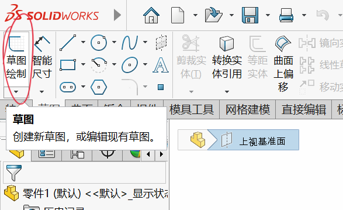

# 从萌新到SOLIDWORKS仙人

作者：[陈羿帆](https://www.zhihu.com/people/xiao-fan-chuan-de-miao-zhu-zi)

**SW，启动！**

[TOC]

## 序章 一张白纸

### 第一节 你学的是个什么玩意儿

早上好，SOLIDWORKS！
在有志成为[华南理工大学RobotIC实验室](https://space.bilibili.com/3493115813955925/)机械组的一员的你开始大展拳脚前，你需要先阅读这一章，**搞明白自己要干什么**。本书旨在为有志加入机械组——以及已经是机械组的一员，但是想修整一下自己的工作习惯的同志们提供指导。

众所周知，本实验室机械组是竞赛队中负责机械设计与制造工作的组，主要业务有机器人的设计、生产，加工设备的维护、管理等等。本书聚焦的就是机械组业务中最核心的**设计**环节。**设计**虽然是一个看起来跟画画很像的工作，但实际上也确实很像。对于大部分洋溢着青涩的大学新生来说，以往经历中与 “设计” 最接近的其实是出黑板报。对于属于“命题作文”的黑板报来说，要成为 “好” 的一期板报，不仅要美观，还要有优质的、**贴合主题**的内容。这就是**设计**与**美术**最大的差别：**设计**要的其实是功能，而**美术**侧重于表达。

显而易见，对机器人进行的**机械设计**本质是创造能够满足特定功能、要求和目标的机械系统。对于有志于参与机械设计工作的新手而言，想要表明自己正在做的是一个怎样的玩意儿，似乎只能在纸上用笔画出来。那么把这样的工作数字化，是不是就是使用**画画软件**用画笔一笔一笔把东西画出来，并且可以称之为**计算机辅助设计**（CAD）了呢？

那不能够啊！21世纪过了五分之一有多了，哪有用电脑用的这么憋屈的。工作不是高考，计算机能帮忙解决的事情为什么还要亲自动手。所谓点两下能画出来的圆就别用笔划，秉持着这样的思想，通过计算机完成横平竖直圆滚滚等乱七八糟的杂活儿，把需要亲自把握的工作留给人，为机械设计提供这样辅助的软件，就是CAD软件。

熟悉数码产品的同志们可能知道，智能手机的世界仿佛一个江湖，操作系统就是各手机的流派，品牌则像是各手机的门派。在CAD的江湖里，主要的门派当属下面这些：AUTODESK公司的AUTOCAD和FUSION，西门子公司的NX（也叫UG），PTC公司的Creo（也就是PRO/E），以及达索系统公司的CATIA和SOLIDWORKS。这些门派中AUTOCAD属于老艺术家，FUSION则是集合众多华丽技术的时尚达人，NX是没有任何幽默感和不良嗜好的样板级德国人，Creo是个现代画家，CATIA是低调的宗师，而我们要学的SOLIDWORKS则是个穿人字拖的靓仔。那么为什么我们选择穿人字拖的靓仔呢？因为它有免费高级版资源，以及它最好学。

因此前面讲了那么多，其实就是为了告诉你，本书要教的是使用SOLIDWORKS进行机械设计。它是一款由达索系统公司——没错，就是研发了 “幻影” 系列和 “阵风” 系列战斗机的那个达索飞机公司的子公司——从美国收购来的，一款适合中小机电系统设计的CAD软件，你能在中文互联网上找到它的破解高级版（免费的哦），并且它在CAD软件中非常好上手。

这下你应该知道你在本书中要学的是什么玩意儿了。

### 第二节 你自己的SOLIDWORKS

在正式开始学习前，你要首先在自己的电脑上**自己安装**SOLIDWORKS。如[上一节](#第一节-你学的是个什么玩意儿)所说，该软件在中文互联网上有**免费的，破解的高级版**，因此任何在这一步付出金钱的同志都应当扪心自问一下，为什么自己成了冤种。你首先需要知道自己要装的是哪个版本的SW——很简单，问一下你们组长就知道了。低版本SW打不开高版本文件，因此请确保你安装的SW版本与其它组员一致。受限于网速，这个过程会花费一定时间，但是任何具备基础电脑技能的人都能依靠破解软件包附带的教程完成。这个过程就像实验室内任何其它过程一样可以自由交流和提问，但操作应当自己完成。

RobotIC机械组组员必须安装的SW组件包括：SW本体，File Ultilities，Visualize，Motion，以及Simulation。在2024年，其余组件除电气设计组件外都可自由安装（安装电气设计组件可能会导致注册错误）。笔者额外安装了Flow Simulations，Plastics，CAM，Composer，Composer Player，Inspection以及MBD。

笔者在RobotIC担任核心队员期间使用的是SW2022，而本书所使用的是SW2024。

## 第一章 认识SOLIDWORKS

### 第一节 认识SW界面

每次你打开SW，它都会弹出一个欢迎页，这一点与大部分软件都是相同的。

欢迎页会提供通过默认模板新建文件的按钮，以及最近打开过的文档。

此次我们先新建一个**零件**文件，认识**零件**这一SW的基本单位。

新建**零件**后SW页面如图所示，最上面是**菜单栏**，其中详细菜单栏可以将鼠标移到Logo旁边的右向灰色三角上方唤出：

菜单栏下面是**选项卡**，可以右键从 “选项卡” 下拉菜单控制显示哪些选项卡。对于RobotIC机械组的同志们来说，需要用到的选项卡如图所示：

窗口右侧是**设计管家菜单**，通过不同的菜单页显示不同类型的设计元素，以树的形式排列，因此也可以叫**设计树菜单**。当前显示的是**FeatureManager 设计树**：

窗口右侧是**任务窗格**，可以从这里找到设计库、外观材质等财产以及自定义属性、文件探索器等菜单：

最下面是分属不同功能算例的工作区，将会在介绍仿真、运动算例等功能时介绍。对于一般的设计，在为建模而设立的 “模型” 区即可完成。如果打开了 “选择过滤器” 工具栏（同样可以在选项卡处右键找到 “工具栏” 下拉菜单进行控制），该工具栏会显示在工作区菜单的下方。

窗口中间显示模型的便是模型窗口，模型视图窗口上方正中的是**视图（前导）工具栏**，可以在这个窗口中选择包括剖面视图、动态注解视图等多种能有效帮助检视模型的视图：

对于RobotIC机械组队员来说，默认的带边线上色的正交图是最常用的视图。透视图只应在制作视觉资料时使用，建模时开启透视图只会使人痛苦。

在本节学习中，你可以多多翻看本节展示的各个菜单及选项卡。这将是你在本书的学习中不断开疆拓土的范围。

### 第二节 年轻人的第一个模型

在本节中，你终于可以开始画SW生涯中的第一个模型了。我们将体验从草图到3D模型的简单过程，并以此作为理解[下一节](#第三节-参考以及sw模型的元素)将要介绍的 “参考” 这个概念的案例。

>【1】在 *FeatureManager 设计树* 中单击选中 *上视基准面* ：
>
>
>【2】打开 *草图* 选项卡，单击选择 *草图绘制* ：
>
>
>
>【3】单击选择 *矩形工具* ，笔者这里在 *矩形工具FeatureManager* 中选择使用 *中心矩形* ：
>
>
>【4】以 *原点* 为中心绘制一个矩形：
>
>
>
>【5】按下Ctrl键依次单击选中两条相邻边线，添加 *相等约束* ：
>*或*
>
>【6】单击选择 *智能尺寸* ，然后单击任意一边拉出 *尺寸标注线* ，在合适的位置再次单击完成标注线放置，双击该尺寸修改数值为10mm，并单击 *绿色勾* 确认完成：
>
>
>【7】打开 *特征* 选项卡，单击选择 *拉伸凸台/基体*，在 *凸台-拉伸FeatureManager* 按图示修改参数，单击 *绿色勾* 确认完成：
>
>
>
>【8】一个正方体就建好了！
>

### 第三节 “参考”，以及SW模型的元素

在本节中你将了解SW模型的三要素：**点、线和面**，但在那之前，有必要引入SW机械设计中的核心要素：**参考**与**参考关系**。

>**参考**是什么？我们可以想象一座桥，对于最最简单的跨越一条小溪的公路桥，将它抽象成简单的线段来说，只需要两个要素去定义它：就是小溪两岸的公路末端，一共两个点。对于这样一个模型，公路桥就是**参考关系**，而这两个点就是**参考**本考。
>
>在这个案例中，如果我们需要修一条从小溪左侧的A到小溪右侧的B的路，我们首先需要将路铺到溪边，然后搭桥，然后将路延伸到B去，注意这个过程是一个不可改变的顺序关系。因此，我们只有修好了A侧的路，才知道A侧的搭桥点在哪里，然后才能确定B侧的搭桥点，进而知道B侧的路该怎么修。进一步说，**B侧搭桥点的参考是A侧的搭桥点，它的位置定义是相对于A侧搭桥点定义的，这种相对位置的定义由桥梁约束**。在SW中，想要将模型各要素的位置完全定义好，避免它在你不经意间跑来跑去，影响零件最终生产出来的效果，就需要将各要素通过约束关系锚定在已定义好的参考上，达到**完全定义**。

回看[上一节](#第二节-年轻人的第一个模型)内容，我们可以知道我们画出来的正方体 *凸台-拉伸1* 是一个基于草图 *草图1* 的拉伸凸台特征，这里 *草图1* 即为 *凸台-拉伸1* 的参考。
具体来说，*凸台-拉伸1* 的4个侧面是基于 *草图1* 正方形的4条边线拉伸形成的，而 *凸台-拉伸1* 的顶面和底面则来自于填充4个侧面的上下边线形成的两个闭环。

**完全定义**的概念将会在草图一节中详细阐述。SW中除三个初始基准面和原点外，所有的设计树对象都需要参考进行定义。

回到正题，你已经了解了**参考**，接下来需要了解的是SW中的**点、线、面**。在SW中，这三种要素非常关键，因为它们就是SW建模过程中可以选择的参考。其中，**面**因为其特殊性，可以作为参考使用的场景与**点和线**有很大不同，具体的使用我们将放在后文具体功能的讲解中分析。

在SW中，点、线、面可以相互参考完成自身的定义，但总的来说是**面->点->线的一个循环**，至于为什么将**面**放在最前面，我们将在**草图**一节中了解。在这个循环中，线通过将点选作参考，结合自己的类型定义自己的位置与形状，而面由线通过直接和间接的方式定义。

### 第四节 初识设计树

我们此时已经明白在SW中创建好用的点、线、面都需要参考，是时候将它们付诸实践，观察具体实现过程中的特性了。观察设计树，我们发现，虽然我们还没进行任何动作，但是设计树上已经有几样东西了。

在设计树中，位于最顶上一行，顶格的是我们**当前文件** “零件1” 的图标和标题，在这下面的三个文件夹、一个叫做**材质**的属性栏，以及三个基准面和原点都是缩进一格排列的，“注解” 文件夹似乎还可以下拉显示内容。敏锐的同志们可能已经发现这样的缩进很眼熟。

>这是你吗？
>是。那时候，我还很瘦。

跟文件浏览器的多级文件夹缩进排列很像吧，其实它们要表达的信息是相似的——就是展现内容项目的分级归属关系，使它们看起来更有条理，更好索引。这就是为什么它叫**设计树**，它将内容项目以树状图的形式列举，方便人们查看和索引。设计树的内容项目叫做**树项目**。设计树通过特征排序、草图吸收等方式展现模型建立顺序与参考关系。

>下面是一个笔者自制的3D打印桌面收纳柜的其中一个零件，观察设计树：
>
>发现几个左边带有小三角的树项目了吗？他们都是吸收了草图的特征，属于对应草图的子特征。
>
>这些草图被特征以不同的程度引用，并体现在图标上。我们将会在[**特征**]()一章的开头详细讲述草图的不同引用程度。

在设计树中，主干，也就是基础的特征一定会出现在上面，而枝叶，也就是上层的特征会出现在下面；树项目的吸收展现的是包含关系，对于我们创建的特征来说，该包含关系指该特征所引用（一级引用）的所有草图。对于相互直接关联的一组特征，基础的特征叫**父特征**，以该特征为参考创建的特征则叫**子特征**。

基于这样的特性，我们在绘图前就应当对零件的形状有一定设想，并规划好草图与特征层级，这样才能尽量避免后面残酷的改图地狱。该思想应当贯穿你的SW生涯的始终，并作为SW绘图的核心技能锻炼。有鉴于它的重要性，你将在学会使用 “特征” 选项卡中各式各样的命令后通过几个案例再次回顾设计树这个玄妙的法宝。

## 第二章 草图

在这一章里，你将详细了解草图中的各种工具，一个合格的SW草图的要素，以及草图工具的综合应用示例。

### 第一节 你啥都没有还想画画？

众所周知，画画是一种在物体表面创作图形的过程。观察这句话，我们发现这个句子表达的意思很明确：画画就是创作图形。当然，画画是要有个什么表面的，没有表面什么都画不出来。你说你没有表面还想画画？你简直就是无情无耻无理取闹（bushi）！

咳咳，言归正传，当我们在SW的**草图**选项卡里直接单击**草图绘制**命令的时候，PropertyManager会要求我们要么选择一个已有平面创建草图，要么选择一个已经存在的草图添加图形：

这意味着如果我们尝试创建一个新的草图，我们首先需要选择一个已有平面，这个平面既可以是**已有模型实体的其中一个平面**，也可以是已有的**基准面特征**。
>基准面特征
>
>已有模型实体的其中一个平面
>

尽管出于节省资源的需要，SW在显示时会将曲面显示为众多多边形，但模型中的所有未经网格实体化的SW原生特征所形成的面事实上都是解析图形，因此对于这种图形，一个面在定义上属于平面那么它将作为平面被识别，并可以作为草图平面使用。

草图中所画出的一切由线条构成的图形都属于**草图实体**。实体顾名思义就是实际存在的东西，在SW中，实体与特征是两种不同的概念，实体对应**实际存在的图形**，而特征对应的是**造型操作**。**草图实体**与**实体**在SW中所指的事实上也并不是同一种东西，前者专指草图中由线条构成的图形，而后者指的是三维图形。我们将在学习**特征**的内容时详细了解**实体**这个概念。

我们从设计树的方面考虑，可以发现草图的基本**父特征**为**草图平面**，且该草图平面是唯一的。草图中的实体可以被其它草图和特征引用，这种情况下这些草图和特征将成为该草图的**子特征**。
